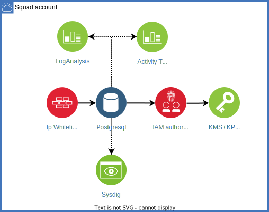

# Module sandbox-database-postgresql

This Atom (terraform module) is used to provision  databases for Postgresql  Database on IBM Cloud Infrastructure with encryption and backup.

## Pre-requesites

If you're not using this module within the Sandbox context, make sure that following resources are available:

- **VPC**
- Monitoring with **Sysdig** with plaform level enabled,
- Logging with **logDNA** with plaform level enabled,
- Autit with **Activity Tracker** with plaform level enabled

## What is provisionned



## Example Usage

### From IBM Cloud Catalog UI

This atom is available in the **Private Sandbox IBM Cloud Catalog**:


You can list the catalog content through the IBM Cloud GUI or by executing following command:

```bash
➜  ~ ibmcloud catalog get  --catalog demo-sandbox                        
```

### From IBM Cloud Catalog CLI

Run the following command to install a software version from the IBM Cloud catalog. [IBM Cloud doc]

```bash
ibmcloud catalog install [--version-locator VERSION_NUMBER] [--override-values VALUES] [--timeout TIMEOUT] [--wait WAIT] [--workspace-name NAME] [--workspace-tags TAGS] [--workspace-tf-version VERSION] [--workspace-region REGION] [--workspace-rg-id ID]
```

> :warning: **As of now, not all parameters can be overriden through the Catalog, ask Sandbox team, if one is not available but required for you.**
> :warning: **As of now, a bug exists in IBM Cloud Schematics Paris, which lead us to execute the schematics workspace in Frankfurt**

### Directly within your terraform
```hcl
module "sandbox-icd-postgresql" {
  source            = "https://github.com/pauljegouic/sandbox-database-postgresql/releases/tag/0.0.1" 
  db_name           = var.db_name
  resource_group    = var.resource_group
  tags              = var.tags
  vpc_name          = var.vpc_name
  vpc_cluster_name  = var.vpc_cluster_name
  namespaces        = var.namespaces
}
```

You can also custom additional inputs through the Terraform module. See below.

## Inputs

| Name                                  | Description                                                       | Type     | Default | Required |
|---------------------------------------|-------------------------------------------------------------------|----------|---------|----------|
| resource_group                        | Resource Group name.                                              | string   | n/a     | yes      |
| vpc_name                              | Resource instance name of your VPC.                               | string   | n/a     | yes      |
| vpc_cluster_name                      | Resource instance name of your VPC Cluster.                               | string   | n/a     | no      |
| namespaces                              | Namespaces where the binding secret should be deployed to                              | list(str)   | n/a     | no      |
| db_name                               | Resource instance name for example, my-postgresql.                | string   | n/a     | yes      |
| region                                | The location or the region in which Database instance exists.     | string   | eu-fr2     | no       |
| database_version                      | The database version to provision if specified.                   | string   | latest     | no       |
| memory_allocation                     | Memory allocation required for database.                          | number   | 1024     | no       |
| disk_allocation                       | Disk allocation required for database                             | number   | 61440     | no       |
| cpu_allocation                        | CPU allocation required for database.                             | number   | 0     | no       |
| kms_instance                          | The CRN of Key protect instance.                                  | string   | n/a     | no       |
| disk_encryption_key                   | The CRN of Key protect key                                        | string   | n/a     | no       |
| backup_encryption_key                 | backup_encryption_key_crn                                         | string   | n/a     | no       |
| tags                                  | Tags for the database                                             | set(str) | n/a     | no       |
| cpu_rate_increase_percent             | Auto Scaling CPU Rate: Increase Percent                           | number   | n/a     | no       |
| cpu_rate_limit_count_per_member       | Auto Scaling CPU Rate: Limit count per number.                    | number   | n/a     | no       |
| cpu_rate_period_seconds               | Auto Scaling CPU Rate: Period Seconds                             | number   | n/a     | no       |
| cpu_rate_units                        | Auto Scaling CPU Rate: Units.                                     | string   | n/a     | no       |
| disk_capacity_enabled                 | Auto Scaling Disk Scalar: Capacity Enabled.                       | bool     | n/a     | no       |
| disk_free_space_less_than_percent     | Auto Scaling Disk Scalar: Capacity Free Space Less Than Percent   | number   | n/a     | no       |
| disk_io_above_percent                 | Auto Scaling Disk Scalar: IO Utilization Above Percent.           | number   | n/a     | no       |
| disk_io_enabled                       | Auto Scaling Disk Scalar: IO Utilization Enabled.                 | bool     | n/a     | no       |
| disk_io_over_period                   | Auto Scaling Disk Scalar: IO Utilization Over Period              | string   | n/a     | no       |
| disk_rate_increase_percent            | Auto Scaling Disk Rate: Increase Percent                          | number   | n/a     | no       |
| disk_rate_limit_mb_per_member         | Auto Scaling Disk Rate: Limit mb per member                       | number   | n/a     | no       |
| disk_rate_period_seconds              | Auto Scaling Disk Rate: Period Seconds                            | number   | n/a     | no       |
| disk_rate_units                       | Auto Scaling Disk Disk: Units.                                    | string   | n/a     | no       |
| memory_io_above_percent               | Auto Scaling Memory Scalar: IO Utilization Above Percent.         | number   | n/a     | no       |
| memory_io_enabled                     | Auto Scaling Memory Scalar: IO Utilization Enabled.               | bool     | n/a     | no       |
| memory_io_over_period                 | Auto Scaling Memory Scalar: IO Utilization Over Period            | string   | n/a     | no       |
| memory_rate_increase_percent          | Auto Scaling Memory Rate: Increase Percent                        | number   | n/a     | no       |
| memory_rate_limit_mb_per_member       | Auto Scaling Memory Rate: Limit mb per member                     | number   | n/a     | no       |
| memory_rate_period_seconds            | Auto Scaling Memory Rate: Period Seconds.                         | number   | n/a     | no       |
| memory_rate_units                     | Auto Scaling Memory Rate: Units.                                  | string   | n/a     | no       |

## Usage

```
terraform init
```
```
terraform plan -var-file="input.tfvars"
```
```
terraform apply -var-file="input.tfvars"
```